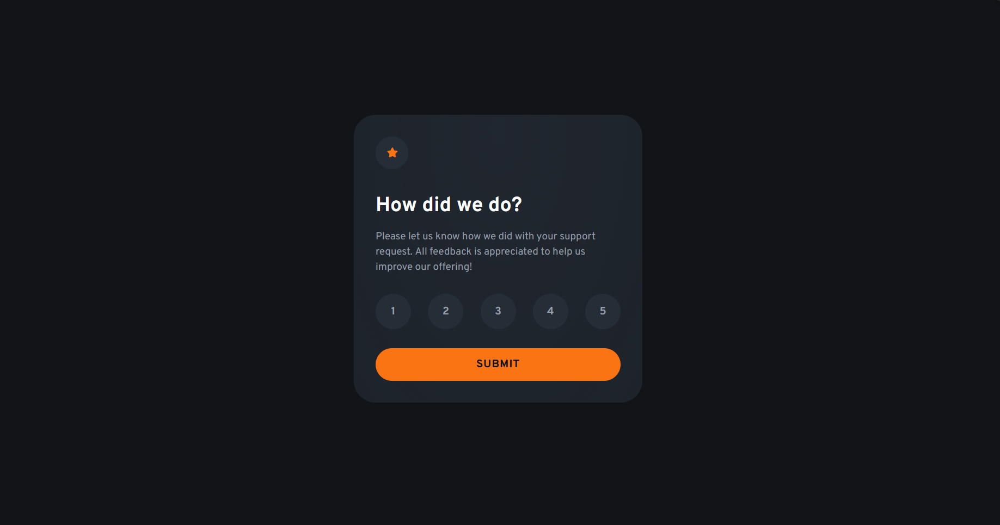

# Frontend Mentor - Interactive rating component solution

This is a solution to the [Interactive rating component challenge on Frontend Mentor](https://www.frontendmentor.io/challenges/interactive-rating-component-koxpeBUmI). Frontend Mentor challenges help you improve your coding skills by building realistic projects. 

## Overview

### The challenge

Users should be able to:

- View the optimal layout for the app depending on their device's screen size
- See hover states for all interactive elements on the page
- Select and submit a number rating
- See the "Thank you" card state after submitting a rating

### Screenshot

### Links

- Live Site URL: [Add live site URL here](https://interactive-rating-component-five-flame.vercel.app/)

## My process

### Built with

- Semantic HTML5 markup
- CSS custom properties
- TailwindCSS
- Flexbox
- Mobile-first workflow

### How selected Rating is stored in state handling.

- When a number is clicked, its value is written into a small central store in main.js via store.set(value).
- The store keeps the rating as a Number in memory and also saves it to localStorage so it can survive a page reload. 
- UI code subscribes to the store, so the selected button gets the .selected class and the Submit button is enabled automatically. 
- On submit the app reads the value with store.get() and displays it on the thank-you screen; if the store is null, submission is blocked.

#### What is state handling?
State handling means a single source of truth for app data with a clear API to read/update and a way for the UI to subscribe/react to changes (often with persistence/validation).